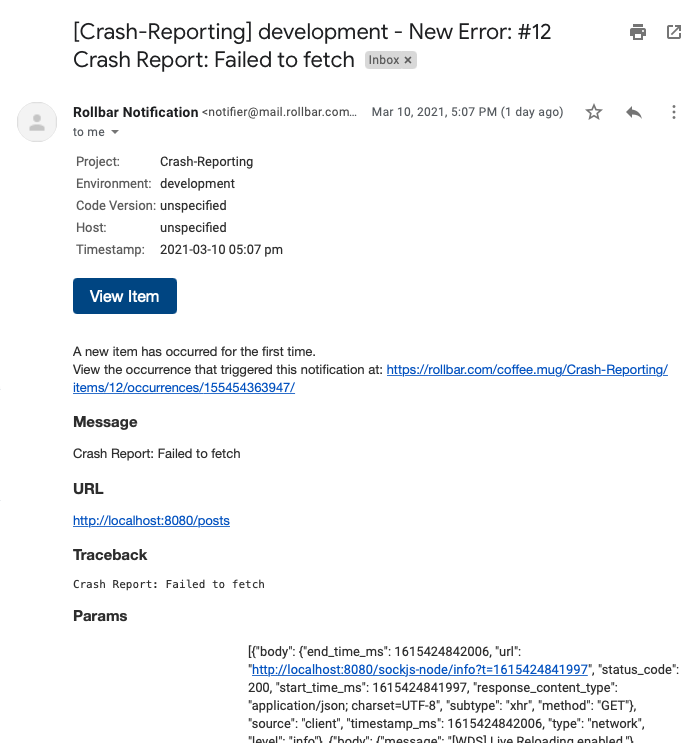
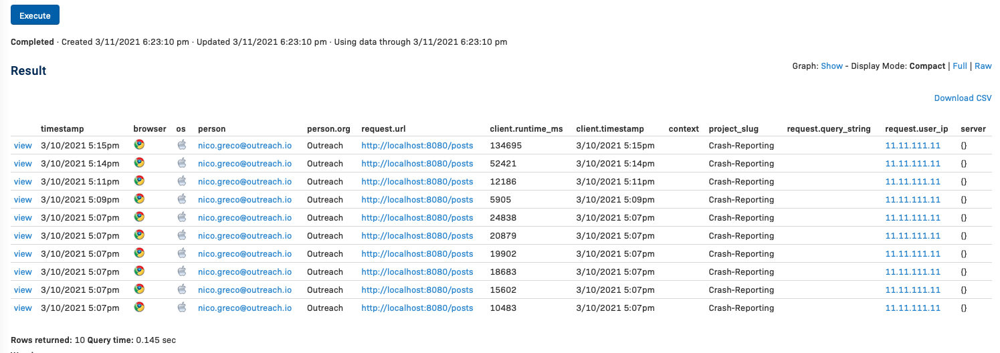
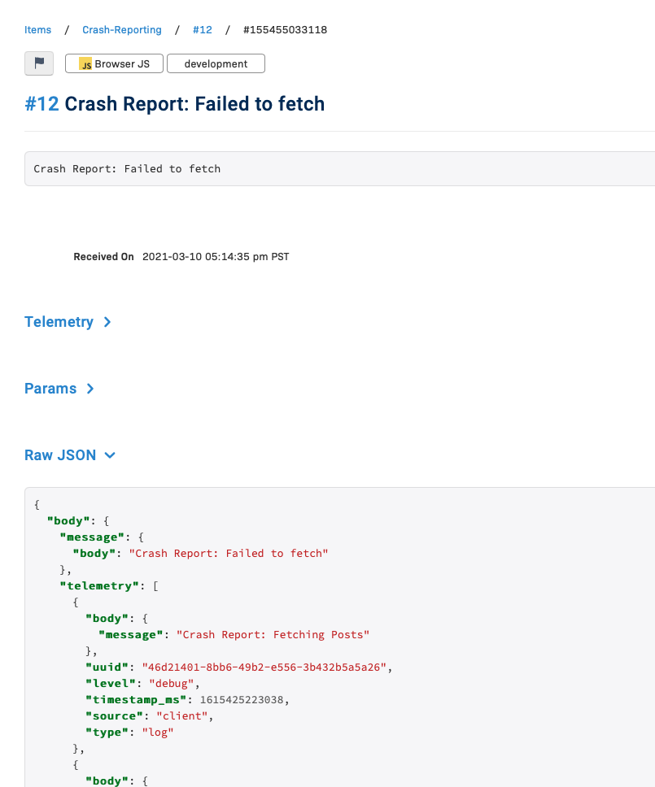

# Crash Team Automation

CTA, has built a new tool to parse through Telemetry events recorded by Rollbar and transforms them into valid Cypress commands in order to provide QA Engineers and Software Engineers with a seamless visual represenation of the exact session undertaken by an end user.

### Why?

Logging is something that tends to be a drag, parsing through logs, and playing out situations in your head only goes so far. Bottom line is that repo steps are always needed when a bug is reported. This means manually going to development regions or spinning up a local development environment and attempting to recreate the steps needed to trigger the defect. This is not without its issues...

> What if the user didn't report all the steps taken correctly? Or worse...what if the user decides it is not their job to report bugs.

Then comes the question. What if instead of having to imagine what the user is going through. What if we could just see exactly what the user saw at any given point during their session?

**Web automation software already exists, and plenty of event logging services already exists, so why not put the two together?**

> Think of it as _almost_ being able to stand over the shoulder of your end user.

## How?

This project accepts Rollbar Telemetry Events in JSON form, and parses them into Typescript Objects. These Typescript Objects serve as then used to construct Cypress commands. Cypress then executes each event one by one until all events have been used up. At that point, the test run is over.

## The Process

It starts with a simple email notification



Here we see the title for this error is "Crash Report: Failed to fetch"

Knowing both the title of this error and the person's email we can query for all the Telemetry Events that lead up to this notification being triggered.

A simple query I would typically run would be something like this...

```SQL
SELECT *
FROM item_occurrence
WHERE person.email = "person@email.com" AND item.title = "Crash Report: Failed to fetch"
ORDER BY timestamp DESC
```

The result of this would be a view that presents all of the matching items for our query. We can view any one of these.



Once viewed, we want the Raw JSON.



And finally, we read the file in our Cypress test run.


